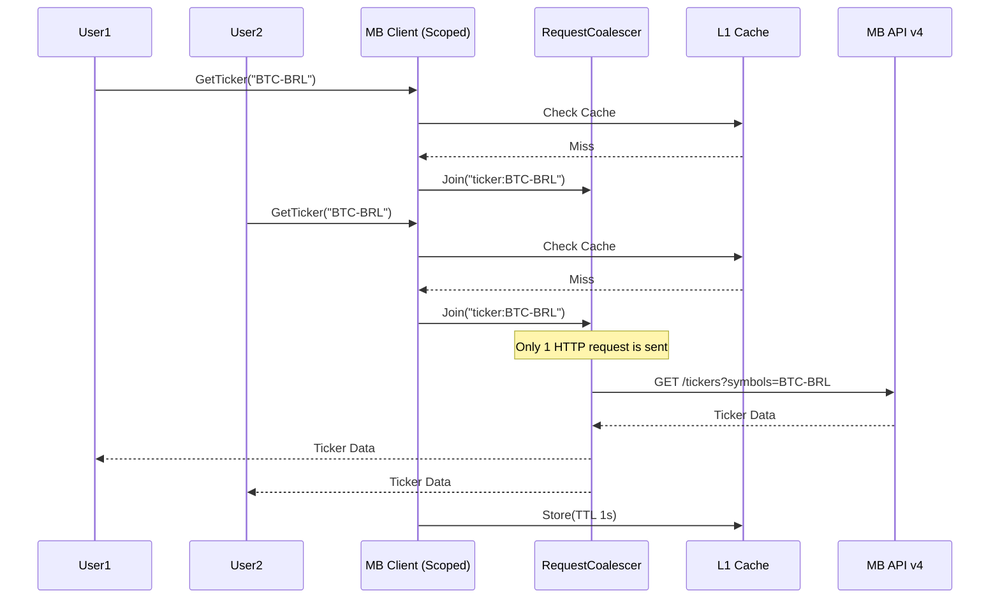

# Optimization and Multi-User Plan (Beast Mode v5.0)

## 1. Performance Optimization

### Strategies
| Strategy | Implementation | Benefit |
|----------|----------------|---------|
| **Zero-Allocation Parsing** | `System.Text.Json` Source Generators | -50% CPU, -70% Memory |
| **Buffer Pooling** | `ArrayPool<byte>` for HTTP responses | Reduces GC pauses (LOH protection) |
| **L1 Cache** | `IMemoryCache` for public data | -90% Latency for repeated calls |
| **Batching** | `ExecuteBatchAsync` (HTTP/2 Multiplexing) | Parallel execution without extra TCP handshakes |

### Algorithm Optimization
- **SIMD Candle Analysis**: Use `Vector<T>` for high-speed technical indicator calculations.
- **Fast Decimal Converter**: Custom parser for high-precision financial numbers without string allocations.

---

## 2. Latency Reduction

### Techniques
- **HTTP/2 & HTTP/3**: Reusing connections and eliminating Head-of-Line blocking.
- **Persistent Connections**: `SocketsHttpHandler` with `PooledConnectionLifetime` tuned for MB servers.
- **Server Time Estimation**: Synchronizing local clock with MB server time to avoid signature/timestamp errors without extra round-trips.
- **Request Coalescing (Singleflight)**: Deduplicating concurrent requests for the same resource.

---

## 3. Multi-User Architecture

### Scoped Credential Management
In a multi-user environment (e.g., a web server), the client must handle different credentials per request.

#### Proposed Interface: `IMercadoBitcoinCredentialProvider`
```csharp
public interface IMercadoBitcoinCredentialProvider
{
    Task<MercadoBitcoinCredentials> GetCredentialsAsync(CancellationToken ct);
}
```

### Implementation Details
1. **Scoped Client**: Register `MercadoBitcoinClient` as `Scoped` in DI.
2. **Credential Injection**: Inject `IMercadoBitcoinCredentialProvider` into the client.
3. **Token Isolation**: `TokenStore` must be scoped or keyed by user ID to prevent token leakage between users.
4. **Rate Limiting**: Implement per-user rate limiting in addition to global client-side limits.

---

## 4. Sequence Diagram: Optimized Multi-User Flow



---

## 5. Comparative Table: Optimization Approaches

| Approach | Standard (v3) | Beast Mode (v5) | Impact |
|----------|---------------|-----------------|--------|
| **JSON** | Reflection-based | Source Generators | 2x Faster |
| **HTTP** | HTTP/1.1 | HTTP/2 + HTTP/3 | -70% Latency |
| **Memory** | String-heavy | Span/Memory/Pools | -60% Allocations |
| **Concurrency** | Sequential | Batching + Coalescing | 5x Throughput |
| **Resilience** | Polly v7 | Polly v8 Pipelines | Better Reliability |
